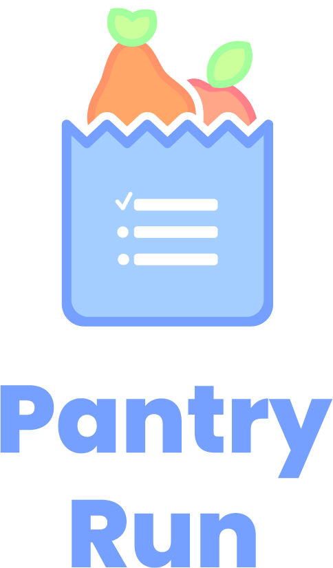

Created by [Delfina 🐬](https://github.com/dolphinstreet) & [Arthur 🤓](https://github.com/Chaudoreille)

# Pantry Run 🍒🍊

Pantry run is a web application to create grocery lists and save them as templates to reuse them quickly.
Done in the context of the Ironhack Web Dev bootcmap Jan '23, this is our second project and is a 2 people project with a 4 days deadline.
It was created using HTML, CSS, JavaScript, Node.js, Express, and MongoDB.

## About 📝

-   Mobile first
-   7 different models (Category, Ingredient, List, Recipe, Tag, Unit, User)
-   Create lists and templates
-   Add products to lists
-   Remove products with swiping motion
-   Check products off lists
-   Authentication
-   Update username and password

## [Try it out !](https://pantry-run.onrender.com/)

## Coming soon 😍

-   Import products from templates to lists
-   Add recipes and import products to lists
-   Add recipes to a calendar to create weekly meal plans
-   Show product categories and sort products by category

## Smallest thing we're really proud of 👏🏻

### Arthur

-   Data cleaning middlewares

### Delfina

-   Swipe to delete

## Installation

### Linux / MacOs

#### requirements

-   git
-   npm
-   mongodb

#### Clone the repo

-   `git clone git@github.com:dolphinstreet/pantry-run.git`
-   `cd pantry-run`

#### install dependencies

`npm install`

#### set environment variables

-   `cp .env.example .env`
-   fill in .env file with your personal values

#### Populate DB (optional)

`npm run seed`

## run server

`npm run start`
